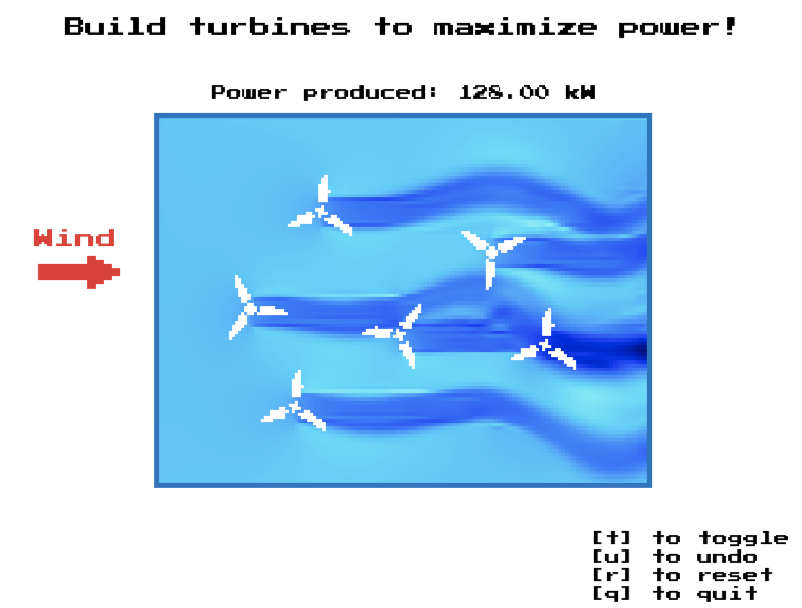

# Wind farm game

## Overview

This is a simple program which provides an arcade-like interface to a
wind farm. The player positions wind turbines while a CFD solver based
on the incompressible Euler equations provides the flow field
solution. Documentation can be found on
[ReadTheDocs](https://windcraft.readthedocs.io/en/latest/).

